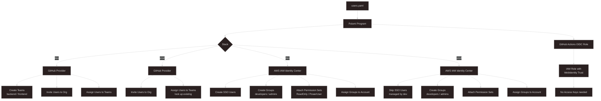
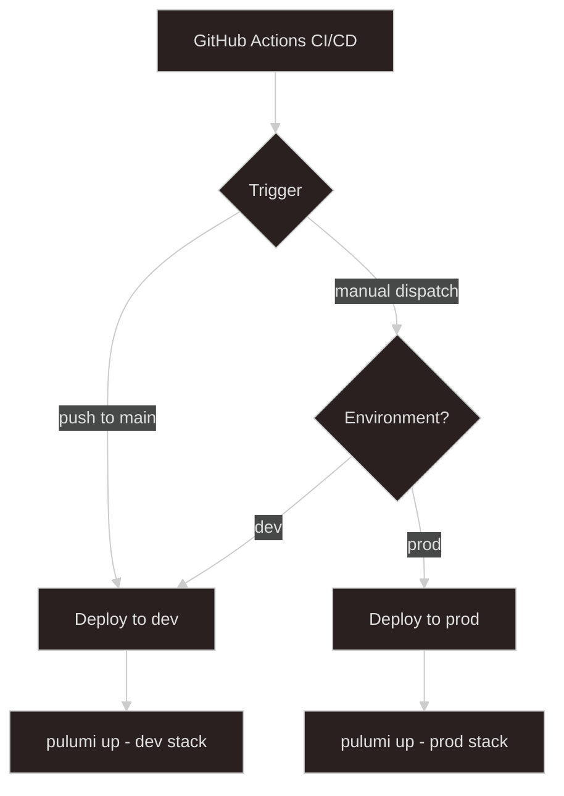

# User Management - Pulumi (TypeScript)

Manages GitHub org membership/teams and AWS IAM users from a single config file.

## Architecture



### CI/CD Flow



## Project Structure

```
.
├── config/
│   └── users.yaml          # Single source of truth for all users
├── src/
│   ├── index.ts            # Pulumi entrypoint
│   ├── config.ts           # Config loader + validation
│   ├── naming.ts           # Naming conventions & tags
│   ├── types.ts            # Shared TypeScript types
│   ├── github/
│   │   └── gitHubUserComponents.ts
│   ├── aws/
│   │   └── awsUserComponents.ts
│   │   └── githubOidcRole.ts
│   └── __tests__/
│       └── config.test.ts
├── .github/workflows/
│   └── deploy.yml          # CI/CD pipeline
├── Pulumi.yaml
├── Pulumi.dev.yaml
├── Pulumi.prod.yaml
└── tsconfig.json
```

## Prerequisites

### AWS Account

- An active AWS account with permissions to create IAM users, groups, roles, and OIDC providers
- AWS CLI configured locally (`aws configure`) or credentials available as environment variables

### GitHub Organization (Free plan)

- A GitHub organization where your account is the **Owner**
- A Personal Access Token (PAT) with the following scopes:
  - `admin:org` — manage org membership and teams
  - `user` — read user profile data

### Pulumi Cloud

- A [Pulumi Cloud](https://app.pulumi.com) account (free tier is sufficient)
- Pulumi CLI installed via the [official installer](https://www.pulumi.com/docs/get-started/install/)
- GitHub integration enabled in Pulumi Cloud (Settings → Integrations → GitHub) for CI/CD to work
- A Pulumi access token (Settings → Access Tokens) for use in GitHub Actions

### Local Tools

- Node.js 20+
- npm

## Setup

### 1. Install dependencies

```bash
npm install
```

### 2. Set Pulumi config secrets

```bash
# GitHub
pulumi config set githubOrg your-org-name (e.g., veron-devops)
pulumi config set --secret github:token ghp_xxxx

# AWS (or use environment variables)
pulumi config set aws:region ap-southeast-2
```

### 3. Add / edit users

Edit `config/users.yaml`. Fields:

| Field         | Required                         |
| ------------- | -------------------------------- |
| `name`        | GitHub username                  |
| `email`       | User email                       |
| `github_team` | `backend` \| `frontend`          |
| `aws_account` | `dev` \| `prod`                  |
| `aws_groups`  | `[developers]` and/or `[admins]` |
| `role`        | `engineer` \| `lead`             |

### 4. Deploy

```bash
# Dev stack
npm run build
pulumi stack select dev
pulumi preview
pulumi up

# Prod stack
npm run build
pulumi stack select prod
pulumi preview
pulumi up
```

### 5. Run tests

```bash
npm test
```

## Secret Management

- GitHub token and AWS credentials are **never in source code**
- GitHub token is stored as a Pulumi encrypted secret
- Using GitHub OIDC for better security instead of using ACCESS KEY and SECRET KEY
- CI reads secrets from GitHub Actions repository secrets

## Multi-Environment Support

Two stacks: `dev` and `prod`. Each has its own `Pulumi.<stack>.yaml` for stack-level config overrides. Resource names are automatically prefixed with `{project}-{stack}-`.

## CI/CD

- **Pull Request** → runs tests + `pulumi preview`
- **Merge to main** → runs tests + `pulumi up` on `prod` stack

Required GitHub Actions secrets:

- `PULUMI_ACCESS_TOKEN`
- `AWS_OIDC_ROLE_ARN`
- `GH_TOKEN`
