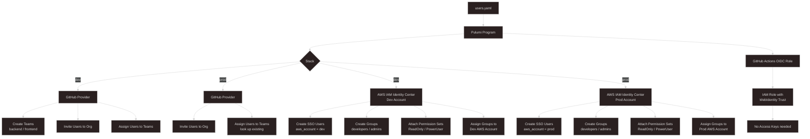
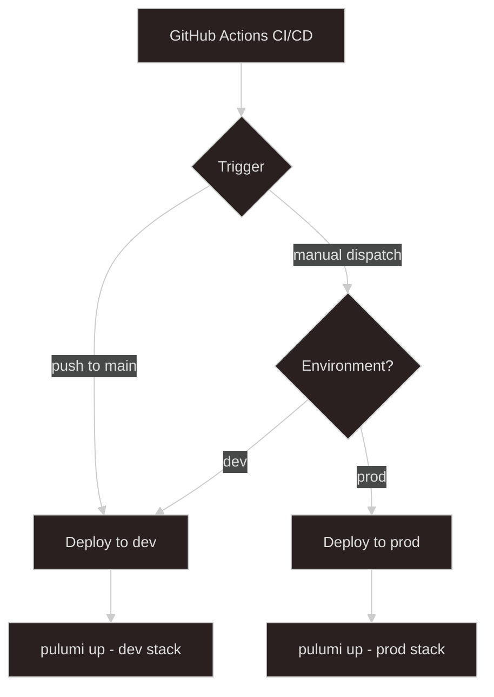
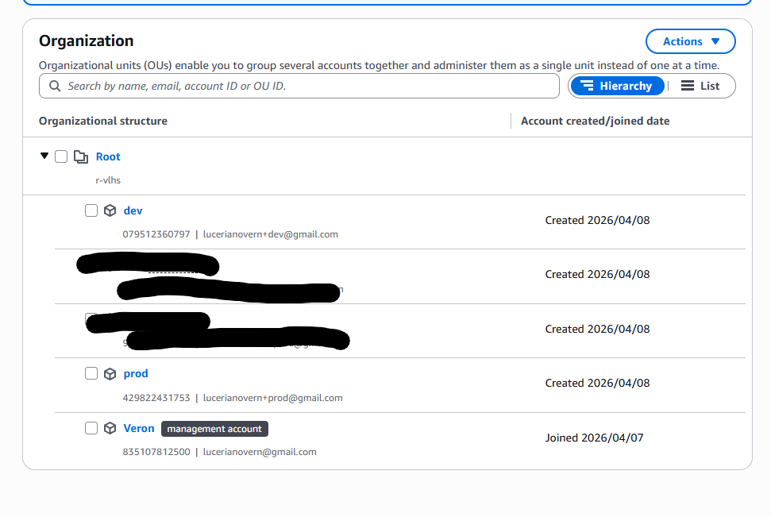
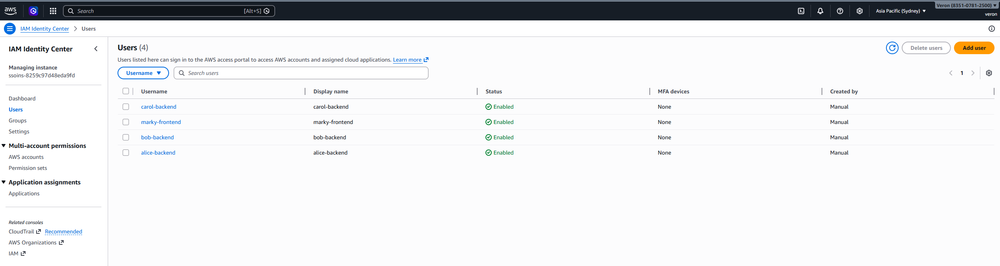
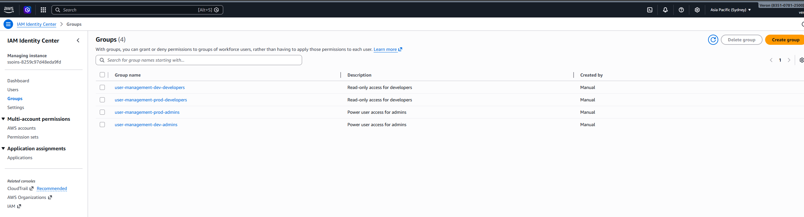
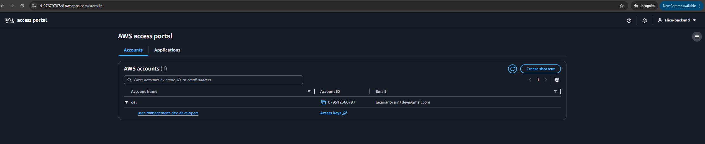
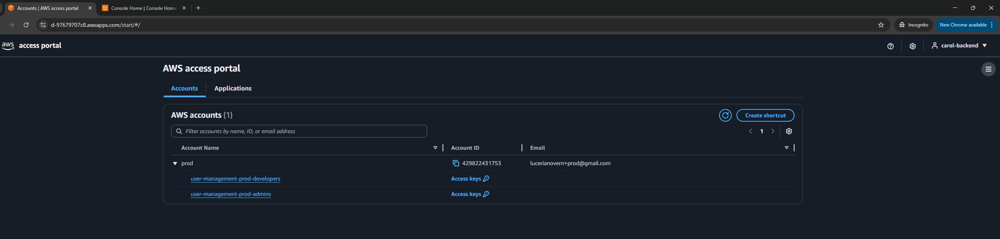
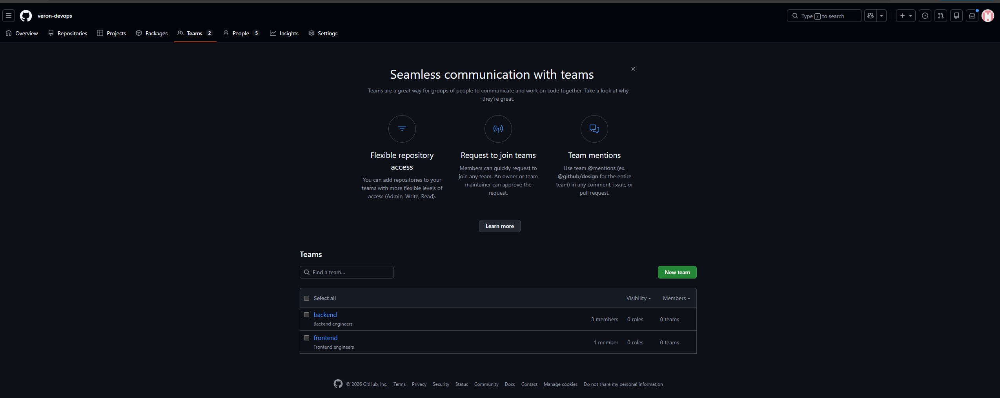
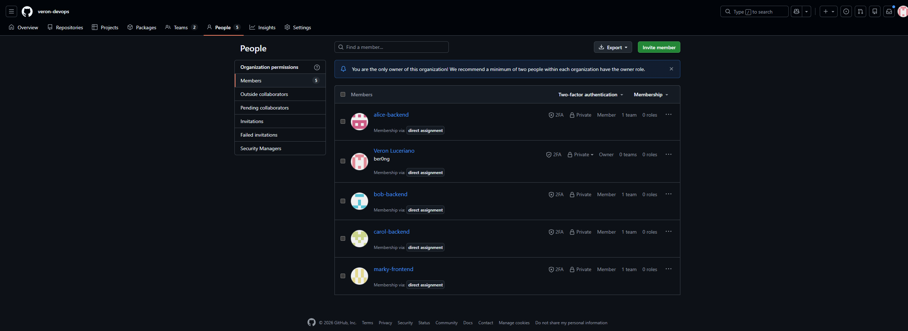
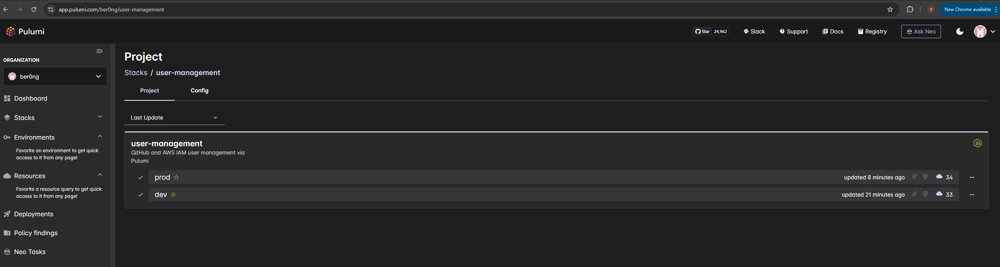

# User Management - Pulumi (TypeScript)

Manages GitHub org membership/teams and AWS IAM Identity Center (SSO) users across multiple AWS accounts from a single config file.

## Architecture



### CI/CD Flow



## Screenshots

### AWS Organization



### AWS IAM Identity Center Users



### AWS IAM Identity Center Groups



### AWS Dev Dashboard



### AWS Prod Dashboard



### GitHub Teams with Members




### Pulumi Stack



## Project Structure

```
.
├── config/
│   └── users.yaml          # Single source of truth for all users
├── docs/
│   └── images/             # Screenshots
├── src/
│   ├── index.ts            # Pulumi entrypoint
│   ├── config.ts           # Config loader + validation
│   ├── naming.ts           # Naming conventions & tags
│   ├── types.ts            # Shared TypeScript types
│   ├── github/
│   │   └── githubUserComponents.ts
│   ├── aws/
│   │   ├── awsUserComponents.ts
│   │   └── githubOidcRole.ts
│   └── __tests__/
│       └── config.test.ts
├── .github/
│   └── workflows/
│       └── deploy.yml      # CI/CD pipeline
├── Pulumi.yaml
├── Pulumi.dev.yaml
├── Pulumi.prod.yaml
└── tsconfig.json
```

## Prerequisites

### AWS Account & Organizations

- An active AWS account enabled as the **management account** in AWS Organizations
- Two member accounts created under the organization:
  - `dev` — for development environment
  - `prod` — for production environment
- AWS IAM Identity Center **enabled** in the management account (AWS Console → IAM Identity Center → Enable)
- AWS CLI configured locally (`aws configure`) or credentials available as environment variables

### GitHub Organization (Free plan)

- A GitHub organization where your account is the **Owner**
- A Personal Access Token (PAT) with the following scopes:
  - `admin:org` — manage org membership and teams
  - `user` — read user profile data

### Pulumi Cloud

- A [Pulumi Cloud](https://app.pulumi.com) account (free tier is sufficient)
- Pulumi CLI installed via the [official installer](https://www.pulumi.com/docs/get-started/install/)
- GitHub integration enabled in Pulumi Cloud (Settings → Integrations → GitHub) for CI/CD to work
- A Pulumi access token (Settings → Access Tokens) for use in GitHub Actions

### Local Tools

- Node.js 20+
- npm

## Setup

### 1. Create the Pulumi project

```bash
# Create a new directory and initialize the Pulumi project
mkdir user-management
cd user-management
pulumi new typescript
```

> When prompted, enter:
>
> - **Project name:** `user-management`
> - **Stack name:** `dev`
> - **Description:** _(optional)_

Then create the prod stack:

```bash
pulumi stack init prod
pulumi stack select dev
```

### 2. Install dependencies

```bash
npm install @pulumi/aws @pulumi/awsx @pulumi/github js-yaml
npm install --save-dev @types/js-yaml @types/jest @types/node jest ts-jest typescript
```

### 3. Set Pulumi config secrets

Run these for the **dev** stack:

```bash
pulumi stack select dev

# GitHub
pulumi config set user-management:githubOrg your-org-name
pulumi config set --secret github:token ghp_xxxx

# AWS
pulumi config set aws:region ap-southeast-2

# AWS IAM Identity Center
pulumi config set user-management:ssoInstanceArn arn:aws:sso:::instance/ssoins-xxxxxxxxx
pulumi config set user-management:ssoIdentityStoreId d-xxxxxxxxx

# AWS Account ID for dev (from AWS Organizations)
pulumi config set user-management:awsAccountId your-dev-account-id

# GitHub Actions OIDC
pulumi config set user-management:githubActionsRepo your-github-username/your-repo-name
```

Then repeat for the **prod** stack:

```bash
pulumi stack select prod

pulumi config set user-management:githubOrg your-org-name
pulumi config set --secret github:token ghp_xxxx
pulumi config set aws:region ap-southeast-2
pulumi config set user-management:ssoInstanceArn arn:aws:sso:::instance/ssoins-xxxxxxxxx
pulumi config set user-management:ssoIdentityStoreId d-xxxxxxxxx

# AWS Account ID for prod (from AWS Organizations)
pulumi config set user-management:awsAccountId your-prod-account-id

pulumi config set user-management:githubActionsRepo your-github-username/your-repo-name
```

> The SSO Instance ARN and Identity Store ID can be found in **AWS Console → IAM Identity Center → Settings**.
> The AWS Account IDs can be found in **AWS Console → AWS Organizations → AWS accounts**.

### 4. Add / edit users

Edit `config/users.yaml`. Fields:

| Field         | Description                                                                |
| ------------- | -------------------------------------------------------------------------- |
| `name`        | GitHub username — must match an existing GitHub account                    |
| `email`       | User email — used for SSO account creation                                 |
| `github_team` | `backend` \| `frontend` — GitHub team to assign the user to                |
| `aws_account` | `dev` \| `prod` — determines which AWS account the user gets SSO access to |
| `aws_groups`  | `[developers]` and/or `[admins]` — IAM Identity Center groups              |
| `role`        | `engineer` \| `lead` — lead becomes team maintainer in GitHub              |

### 5. Deploy

```bash
# Dev stack — creates SSO users with aws_account: dev
npm run build
pulumi stack select dev
pulumi preview
pulumi up

# Prod stack — creates SSO users with aws_account: prod
npm run build
pulumi stack select prod
pulumi preview
pulumi up
```

### 6. Run tests

```bash
npm test
```

## Secret Management

- GitHub token and AWS credentials are **never in source code**
- GitHub token is stored as a Pulumi encrypted secret
- Using GitHub OIDC for CI/CD instead of long-lived AWS access keys
- CI reads secrets from GitHub Actions repository secrets

## Multi-Environment Support

Two stacks: `dev` and `prod`, each backed by a separate AWS member account under AWS Organizations.

| Stack  | AWS Account  | SSO Users           | GitHub Teams           |
| ------ | ------------ | ------------------- | ---------------------- |
| `dev`  | Dev account  | `aws_account: dev`  | shared org-level teams |
| `prod` | Prod account | `aws_account: prod` | shared org-level teams |

- Resource names are automatically prefixed with `{project}-{stack}-`
- GitHub teams (`backend`, `frontend`) are **org-level** and shared across stacks
- SSO users are filtered by `aws_account` field — each user only gets access to their designated account

## CI/CD

- **Pull Request** → runs tests + `pulumi preview` on dev
- **Push to main** → runs tests + `pulumi up` on dev stack
- **Manual dispatch** → choose `dev` or `prod` environment

Required GitHub Actions secrets:

| Secret                | Description                                                                            |
| --------------------- | -------------------------------------------------------------------------------------- |
| `PULUMI_ACCESS_TOKEN` | Pulumi Cloud access token                                                              |
| `AWS_OIDC_ROLE_ARN`   | IAM role ARN for GitHub Actions (output of `pulumi stack output githubActionsRoleArn`) |
| `GH_TOKEN`            | GitHub PAT with `admin:org` and `user` scopes                                          |

## Troubleshooting

### Pulumi is not logged in

```
error: no credentials provided
```

You are not authenticated with Pulumi Cloud. Run:

```bash
pulumi login
```

---

### Missing required configuration variable

```
error: Missing required configuration variable 'user-management:xxx'
```

A config value is missing for the current stack. Refer to [Set Pulumi config secrets](#3-set-pulumi-config-secrets) and set the missing value:

```bash
pulumi config set user-management:<variable> <value>
```

---

### GitHub token has insufficient scopes

```
error: 403 Forbidden
```

Your PAT does not have the required scopes. Regenerate it with `admin:org` and `user` scopes in GitHub → Settings → Developer settings → Personal access tokens.

---

### GitHub username not found (404)

```
error: 404 Not Found — PUT /orgs/{org}/memberships/{username}
```

The `name` field in `users.yaml` does not match a real GitHub username. Make sure each user has an existing GitHub account and the username is spelled correctly.

---

### AWS IAM Identity Center not enabled

```
error: ResourceNotFoundException
```

IAM Identity Center has not been enabled in your AWS account. Go to **AWS Console → IAM Identity Center → Enable** before running `pulumi up`.

---

### AWS insufficient permissions

```
error: AccessDenied
```

The AWS credentials being used lack permissions to create the required resources. Ensure the IAM user or role has permissions for `identitystore:*`, `ssoadmin:*`, `iam:*`, and `sts:GetCallerIdentity`.

---

### TypeScript compilation error

```
error TS2345: Argument of type...
```

Run the build to see the full error:

```bash
npm run build
```

Fix the TypeScript error in `src/` before running `pulumi up`.

---

### `pulumi up` runs but no changes applied

The compiled output in `bin/` is stale. Always build before deploying:

```bash
npm run build && pulumi up
```
